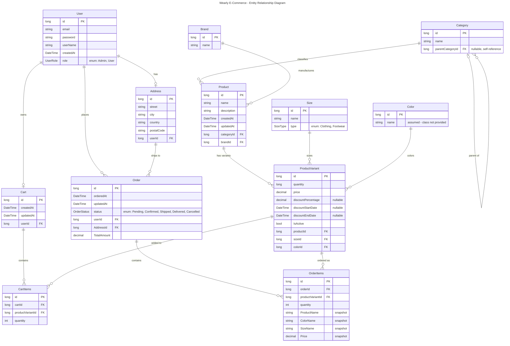

# Wearly E-Commerce

```mermaid
---
title: Wearly E-Commerce - Entity Relationship Diagram
---
erDiagram
    User {
        long id PK
        string email
        string password
        string userName
        DateTime createdAt
        UserRole role "enum: Admin, User"
    }

    Address {
        long id PK
        string street
        string city
        string country
        string postalCode
        long userId FK
    }

    Cart {
        long id PK
        DateTime createdAt
        DateTime updatedAt
        long userId FK
    }

    CartItems {
        long id PK
        long cartId FK
        long productVariantId FK
        int quantity
    }

    Order {
        long id PK
        DateTime orderedAt
        DateTime updatedAt
        OrderStatus status "enum: Pending, Confirmed, Shipped, Delivered, Cancelled"
        long userId FK
        long AddressId FK
        decimal TotalAmount
    }

    OrderItems {
        long id PK
        long orderId FK
        long productVariantId FK
        int quantity
        string ProductName "snapshot"
        string ColorName "snapshot"
        string SizeName "snapshot"
        decimal Price "snapshot"
    }

    Category {
        long id PK
        string name
        long parentCategoryId FK "nullable, self-reference"
    }

    Brand {
        long id PK
        string name
    }

    Product {
        long id PK
        string name
        string description
        DateTime createdAt
        DateTime updatedAt
        long categoryId FK
        long brandId FK
    }

    ProductVariant {
        long id PK
        long quantity
        decimal price
        decimal discountPercentage "nullable"
        DateTime discountStartDate "nullable"
        DateTime discountEndDate "nullable"
        bool IsActive
        long productId FK
        long sizeId FK
        long colorId FK
    }

    Size {
        long id PK
        string name
        SizeType type "enum: Clothing, Footwear"
    }

    Color {
        long id PK
        string name "assumed - class not provided"
    }

    User ||--o| Cart : "owns"
    User ||--o| Address : "has"
    User ||--o{ Order : "places"
    Address ||--o{ Order : "ships to"
    Cart ||--o{ CartItems : "contains"
    Order ||--o{ OrderItems : "contains"
    Category |o--o{ Category : "parent of"
    Category ||--o{ Product : "classifies"
    Brand ||--o{ Product : "manufactures"
    Product ||--o{ ProductVariant : "has variants"
    Size ||--o{ ProductVariant : "sizes"
    Color ||--o{ ProductVariant : "colors"
    ProductVariant ||--o{ CartItems : "added to"
    ProductVariant ||--o{ OrderItems : "ordered as"
```
